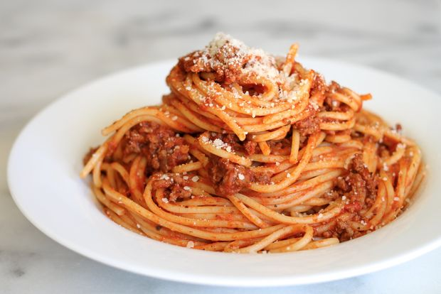

# Section 1

Get Ready...

## First Slide {.fill .nobackground #spaghetti-slide}

For more details on authoring R presentations please visit <https://support.rstudio.com/hc/en-us/articles/200486468>.



- Bullet 1
- Bullet 2
- Bullet 3

# Section 2

Here we go...

## Slide With Code

```{r}
summary(cars)
```

## Slide With Plot

```{r, echo=FALSE}
plot(cars)
```
