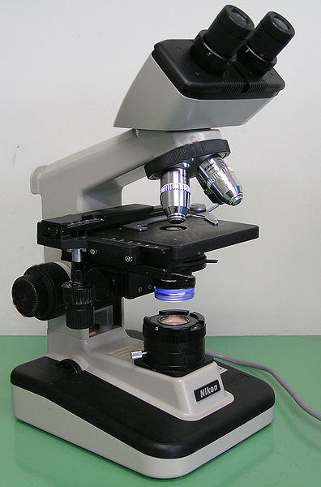

<script src='/assets/helpers.js'></script>

## Overview {.side-image}


- What is *data*?
- What is a *database*?
- What are some kinds of databases?  Cause this is a really long line.
- Hands-on examples
    - HTML5 localStorage
    - sqlite3
    - R with rsql
- Conclusion

# What is "Data" | Let's orient the epistemology

## The Word "Data" {.side-image}


- data (plural), datum (singular)
- etymology
    - borrowed from Latin
    - noun: gift, present
- English language definitions
    + a measurement
    + a fact from direct observation

<div style="font-style: italic;">
<p>Quia non suppetunt dictis <b>data</b>.</p>
<p>Because his gifts do not match his words.</p>
&mdash; Plautus, Asinaria 56 (c. 254 BCE – 184 BCE)
</div>

## Looking at the World {.side-image .bigger}



- Observations, measurements, values, results
    - specific to your domain of inquiry
    - data is a general concept
- data may be recorded or encoded
    - making marks on paper
    - arranging numbers into tables
    - digital encoding
- data are often the basis for scientific inquiry

## Table Topology {.side-image}


- Table: a 2-D matrix with rows, columns, and maybe row/column names
- Which way is this table oriented?
    - *wide*: variable in its own column, case/id/event on its own row.
    - *long*: every data point on its own row.  Common columns: id, variable, value.  (e.g. time series data.)
    - *pivot*: some mixture of raw and summary data.  Common for data portals and Excel.
- Transpose: rotate table so columns become rows

## Information: a Property of our Universe {.side-image .bigger}


- Information is physical, just like energy and mass.
    + Maxwell's demon (1872): information reduces entropy
- *Shannon information* (1948)
    - entropy is unpredictability
    - information is knowledge about an unpredictable event
- **binary**: 0 or 1 ("base-2 number system")
- **bit**: the amount information a binary value can contain

## Binary Encodings {.side-image .bigger}


- **byte**: 8 bits of information
- **encoding**: use information (*bytes*) to transmit a message (*data*)
- **ASCII** (1960): American Standard Code for Information Interchange; a 1-byte encoding
- **UTF-8** (1993): Unicode Transformation Format; *n-byte* encoding

<div class="build">

</div>

<!-- animate an arrow to point out the HORIZONTAL TAB character (ASCII 9) -->

## Summary: What is "Data?" {.side-image .bigger}


- *data* are specific to your research
    + literally: a gift
- *encode* your *data* as digital *information*
    - possibly with expensive measurement hardware
- an **information system** stores and retrieves your *data*
    - maybe you have access to a digital computer?  That would be a good information system.
    - punch cards will work, but I recommend a Solid State Drive (SSD)

# Databases | a brief discussion of several ways to store information

## Introducing the Database {.side-image .bigger}


- **database**: a type of information system
    - can be customized for different sorts of work
    - usually has optimizations for "scaling up"
- different types of databases are suited for different work

## Types of Databases {.side-image}


- flat files
    + tab delimited, CSV, fixed width
- data objects
    + excel, JSON, R data.frame
- key/value storage
    + HTML5 localStorage, Redis, Memcache
- relational
    + sqlite3, PostgreSQL, MySQL, MS SQL Server
- document
    + CouchDB, MongoDB, Hadoop HDFS
- graph
    + Neo4J, OrientDB

## Flat Files {.side-image}


- Essentially just a table (matrix)
- Tab Delimited
    - ASCII encoding, character #9 is a delimiter
    - literally how a printer would print tables
- CSV (Comma Separated Values)
    + Excel Dialect
        + quote is "
        + double-quote (i.e. "" for literal quote in field)
        + CRLF
- Fixed Width

## Data objects {.side-image}


- Excel
    + Binary object format
    + requires special software to read/write
    + includes *expressions*, beyond data
- JSON
    + data is JavaScript
    + object types: string, integer, float, *array*, *dictionary*
    + moving beyond matrix
- R data.frame
    + data *and* metadata

## key/value storage {.side-image}

## relational {.side-image}

## document {.side-image}

## graph {.side-image}

# Hands on: Map/Reduce

## Load some data {.smaller}

```{javascript}
get_json("/assets/ghimpact-b3.json");
```

```{javascript}
Object.keys(df);
// wait
```

```{javascript}
df["mattn"]["s"];
// Array.proto.map, Array.proto.reduce
// the scores come from the data frame keys using this map function
var scores = Object.keys(df).map( function(key) { return( df[key]["s"] ) } );
var average = scores.reduce( function(sum, val) { return( sum + val ) }, initialValue=0 ) / scores.length;
Math.max.apply(Math, scores);
```

# SQL

# Conclusion

## Thank you
