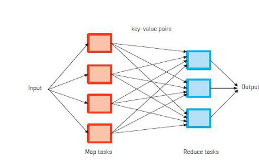
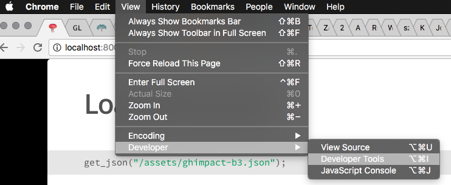

<script src='/assets/helpers.js'></script>

## Overview {.side-image}


- What is *data*?
- What is a *database*?
- Hands-on examples
    - JSON and Map/Reduce
    - sqlite3
    - R with rsql
- Conclusion

# What is "Data" | Let's orient the epistemology

## The Word "Data" {.side-image}


- data (plural), datum (singular)
- etymology
    - borrowed from Latin
    - noun: gift, present
- English language definitions
    + a measurement
    + a fact from direct observation

<div style="font-style: italic;">
<p>Quia non suppetunt dictis <b>data</b>.</p>
<p>Because his gifts do not match his words.</p>
&mdash; Plautus, Asinaria 56 (c. 254 BCE – 184 BCE)
</div>

## Looking at the World {.side-image .bigger}


- Observations, measurements, values, results
    - specific to your domain of inquiry
    - data is a general concept
- data may be recorded or encoded
    - making marks on paper
    - arranging numbers into tables
    - digital encoding
- data are often the basis for scientific inquiry

## Table Topology {.side-image}


- Table: a 2-D matrix with rows, columns, and maybe row/column names
- Which way is this table oriented?
    - *wide*: variable in its own column, case/id/event on its own row.
    - *long*: every data point on its own row.  Common columns: id, variable, value.  (e.g. time series data.)
    - *pivot*: some mixture of raw and summary data.  Common for data portals and Excel.
- Transpose: rotate table so columns become rows

## Information: a Property of our Universe {.side-image .bigger}


- Information is physical, just like energy and mass.
    + Maxwell's demon (1872): information reduces entropy
- *Shannon information* (1948)
    - entropy is unpredictability
    - information is knowledge about an unpredictable event
- **binary**: 0 or 1 ("base-2 number system")
- **bit**: the amount information a binary value can contain

## Binary Encodings {.side-image .bigger}


- **byte**: 8 bits of information
- **encoding**: use information (*bytes*) to transmit a message (*data*)
- **ASCII** (1960): American Standard Code for Information Interchange; a 1-byte encoding
- **UTF-8** (1993): Unicode Transformation Format; *n-byte* encoding

<div class="build">

</div>

<!-- animate an arrow to point out the HORIZONTAL TAB character (ASCII 9) -->

## Summary: What is "Data?" {.side-image .bigger}


- *data* are specific to your research
    + literally: a gift
- *encode* your *data* as digital *information*
    - possibly with expensive measurement hardware
- an **information system** stores and retrieves your *data*
    - maybe you have access to a digital computer?  That would be a good information system.
    - punch cards will work, but I recommend a Solid State Drive (SSD)

# Databases | a brief discussion of several ways to store information

## Introducing the Database {.side-image .bigger}


- **database**: a type of information system
    - can be customized for different sorts of work
    - usually has optimizations for "scaling up"
- a database is software running on hardware
    + download it, run it, use it
- sometimes a database is embedded inside software
    + e.g. Firefox and Chrome store browser history in a database

## Types of Databases {.side-image .smaller}


- flat files (1960s)
    + Tab delimited, CSV, fixed width
- relational (1970s)
    + sqlite3, PostgreSQL, MySQL, MS SQL Server
- binary "blob" data objects (1980s)
    + Excel, SPSS data file, R environment image
- key/value storage (2000s)
    + Bigtable, Memcache, Redis, HTML5 localStorage
- graph (2000s)
    + Neo4J, OrientDB
- document (2010s)
    + JSON, CouchDB, MongoDB, Hadoop HDFS

## Flat Files {.side-image}


- Essentially just a table (matrix)
- Tab Delimited
    - ASCII encoding, character #9 is a delimiter
    - literally how a printer would print tables
- CSV (Comma Separated Values)
    + Excel Dialect
        + quote is "
        + double-quote (i.e. "" for literal quote in field)
        + CRLF
- Fixed Width: each column is exactly *n* characters

## Binary "blob" Data objects {.side-image}


- You need a special program to use these files
    + still basically just a table (like flat files)
    + files usually include data *and* metadata
- examples of programs that use blobs
    - Excel
        + includes *expressions* in addition to data
        + some might argue Excel is the most prolific database software used today
    - SPSS data files
    - R environment image

## key/value storage {.side-image}


- BigTable
- HTML5 localStorage
- Redis
- Memcache

## relational {.side-image}

- Sqlite3 (weakest, easiest)
- PostgreSQL (recommended)
- MySQL
- MS SQL Server

## document {.side-image}

- JSON
    + data is JavaScript
    + object types: string, integer, float, *array*, *dictionary*
    + moving beyond matrix
- CouchDB
- MongoDB
- Hadoop (HDFS with Map/Reduce)

## graph {.side-image}

- Neo4J
- OrientDB

## Summary: Databases {.side-image}

# Hands on: MapReduce

## Map and Reduce {.side-image .smaller}



- map: $map(x) = x^2$
    - input values: [1, 2, 3]
    - create *map* of [1, 2, 3] with $map(x)$
        + $map_1 = 1^2 = 1$
        + $map_2 = 2^2 = 4$
        + $map_3 = 3^2 = 9$
    - map result: [1, 4, 9]
- reduce: $sum_i = map_i + sum_{i-1}$
    + *reduce* map result [1, 4, 9] with $sum$
    + $sum_1 = 1 + 0$
    + $sum_2 = 4 + 1$
    + $sum_3 = 9 + 5 = 14$

## Try it yourself {.flexbox .vcenter}

<div class="centered">
http://iandennismiller.github.io/uoft-coders-sql
</div>

<div class="centered">

</div>

## Example: gh-impact {.smaller}

Load a JSON file

```{javascript}
get_json("/assets/ghimpact-b3.json");
// wait
```

View the usernames

```{javascript}
Object.keys(df);
```

```{javascript}
df["mattn"]["s"];
// Array.proto.map, Array.proto.reduce
// the scores come from the data frame keys using this map function
var scores = Object.keys(df).map( function(key) { return( df[key]["s"] ) } );
var average = scores.reduce( function(sum, val) { return( sum + val ) }, initialValue=0 ) / scores.length;
Math.max.apply(Math, scores);
```

## Statistics with MapReduce

Mean

$\mu = \frac{1}{n}\displaystyle\sum_{i=1}^{n} x_i$

MapReduce Equivalent

- map: $map_i = x_{i}$
- reduce:
    - $sum_{0} = map_{0}$
    - $sum_{i} = map_{i} + sum_{i-1}$
- $mean = \frac{1}{n} sum$

## Summary: MapReduce

- Many statistical functions can be represented in terms of MapReduce
- Databases that support MapReduce theoretically provide good scalability
    + Hadoop
    + CouchDB
- Often uses javascript

# Hands on: R with rsql

# Hands on: R with RSQLite

# Hands on: SQL with sqlite3

## Plan {.smaller}

- launch sqlite3 with a DB file
- help for sqlite
- how to read errors
- how to search for more information
- import and export CSV
- SELECT count() WHERE
- SELECT ... WHERE
- SELECT ... JOIN
- SELECT FROM
- SELECT AS
- INSERT ...
- UPDATE ... WHERE
- ALTER ...
- DELETE ... WHERE

# Conclusion

## Thank you
